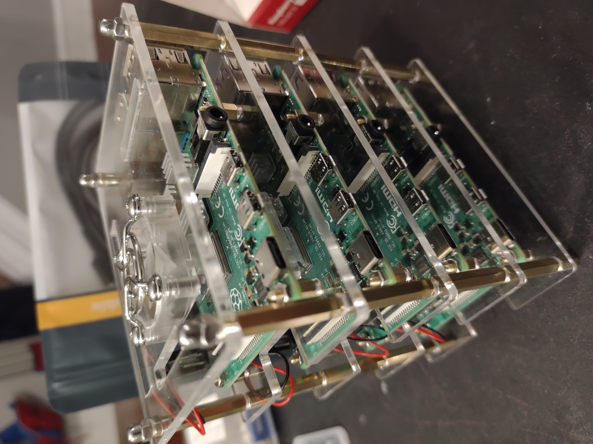

First, we attach the heat sinks to the pis. The GeeekPi Cluster Case comes with four heat sinks for each pi: a short small square, a tall small square, a large square, and a rectangle. All the heat sinks are aligned with the fins in the same direction, and can use the rectangle as a guide for that. With that in mind, the following directions are written with the orientation of the pi with the USB and ethernet ports on the right, facing right. The rectangle heat sink goes on the black rectangle component on the pi. The large square goes on the silver square component directly to the left of the rectangle. The short small square goes on the smaller black square component to the right of the rectangle, closer to the top of the board. The tall small square goes on the slightly larger black square component to the right of the rectangle, slightly closer to the bottom of the board.

Next, we primarily follow the instructions on the GeeekPi Cluster Case assembly. However, we replace the regular screws in step 1 at the bottom of the case assembly with extra standoffs: For the SSD to fit, we use standoffs that are about 3/8 inches tall.

We assemble the pis such that the pi on top (with the exposed GPIO header pins) is the one with 2GB RAM. 

We assembled the fans such that the label side of the fan is facing the pi it is intending to cool. When connecting the fan to the pi underneath it, connect the red (5V) wire to the top left GPIO pin header, and the black (GND) wire to the top third-from-left GPIO pin header.

[//]: #  (the first bit of this line basically makes it a comment, since it's creating a link object that is never actually called.)

 
Next, we place the SSD on its 3D printed holder plate, and use standoffs to attach the bottom of the GeeekPi Cluster Case assembly to it. We align it such that the port to the SSD faces outwards to the opening, and is on the same side of the assembly as the ethernet ports on the pis.

Similarly, we place the USB Power hub on the 3D printed holder plate to hold it, and use standoffs (and extra M3 Acorn Nuts) to attach the plate to the plate above. We align it such that the USB ports on the hub are on the same side of the assembly as the USB-c ports (and mini HDMI ports) of the pis.

Finally, we place the ethernet port switch on the 3D printed holder plate to hold it, and use standoffs (and screws for the bottom) to attach it to the plate above. We align it such that the ethernet ports on the port switch are on the opposite side of the cluster assembly as the USB ports on the power hub.


Add image of completed assembly, like above?

